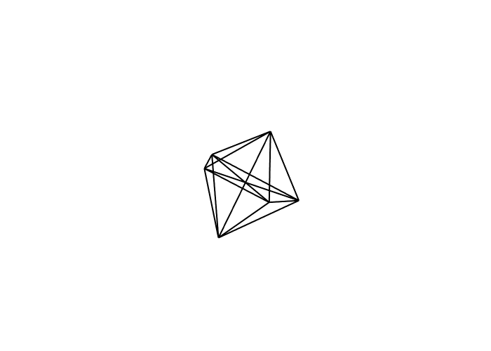
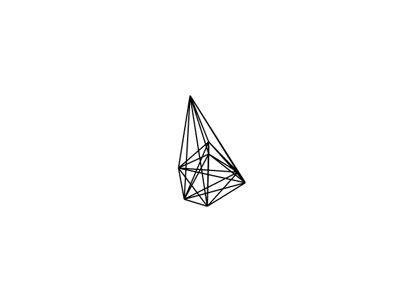

# Klastry
Comparing the effectivnes of PSO and Genetic algorithm in finding the structure of clusters with minimum possible energy surface using the sum of Morse potentials expressed by the formula:

$$V_{m}=\sum\limits_{i &lt; j} e^{p_{0}\cdot(1-r_{ij})}(e^{p_{0}\cdot(1-r_{ij})}-2)$$

where:
* $r_{ij}$ is distance in 3D space between particles $i$ and $j$
* $p_0$ is the force of attraction between particles in the cluster for a given material

*Example result of PSO algorithm for cluster of size 6 with force of attraction of 3*

*Example result of genetic algorithm for cluster of size 8 with force of attraction of 3*

 

The detailed project description, including further explanations of results and assumptions, is located in the [pdf](result.pdf) in Polish.
